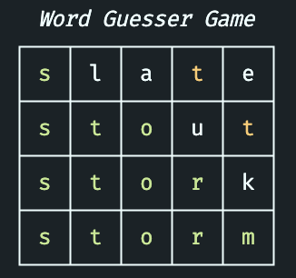
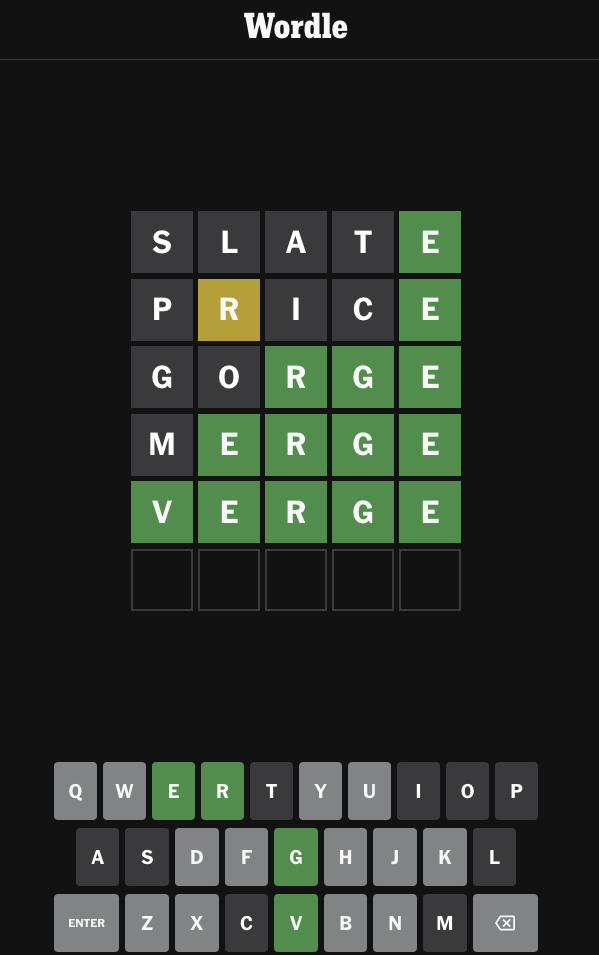

# What's my Wordle

Tool for suggesting words to classic Wordle word game based on available information.

## Playing a New Game

Start a new game by initializing the `WordGuesser` class. If you have an answer in mind, use the `answer` key-word argument.

```python
from src.game import WordGuesser

game = WordGuesser(answer="storm")

while not game.game_over:
    game.guess_word(game.suggest_word(method="highest_frequency"))
```



### Game Info

In the example above, I use the `suggest_word()` method to generate the next logical input based on available information (accessible via `game.info`).

```
{
    'positions': {
        0: {
            'match': 's',
            'miss': set()
        },
        1: {
            'match': 't',
            'miss': {'l'}
        },
        2: {
            'match': 'o',
            'miss': {'a'}
        },
        3: {
            'match': 'r',
            'miss': {'t','u'}
        },
        4: {
            'match': 'm',
            'miss': {'k','t','e'}
        }
    },
    'does_not_contain': {'l','u','a','k','e'},
    'does_contain': {'t'},
    'guesses': ['slate', 'stout', 'stork', 'storm']
}
```

### Game Assist

To play a game where you don't know the answer (https://www.nytimes.com/games/wordle/index.html), call the `WordGuesserAssist` class. Note you'll have to tell the class which colors you got back! The example below is the solution from February 4th, 2024.

```python
from src.game import WordGuesserAssist

assist = WordGuesserAssist()

assist.suggest_word(method="highest_frequency") # "slate"
assist.new_guess("slate", colors=("", "", "", "", "green"))

assist.suggest_word(method="highest_frequency") # "price"
assist.new_guess("price", colors=("", "yellow", "", "", "green"))

assist.suggest_word(method="highest_frequency") # "gorge"
assist.new_guess("gorge", colors=("", "", "green", "green", "green"))

assist.suggest_word(method="highest_frequency") # "merge"
assist.new_guess("merge", colors=("", "green", "green", "green", "green"))

assist.possible_answers # ["verge"]
```



## Solution Methods

### `highest_frequency`

### `random`

## Data

Datasets (`valid_solutions.csv` and `valid_guesses.csv`) come from https://www.kaggle.com/datasets/bcruise/wordle-valid-words?resource=download
